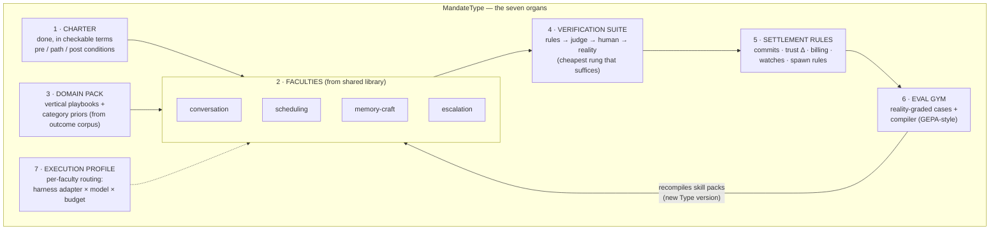
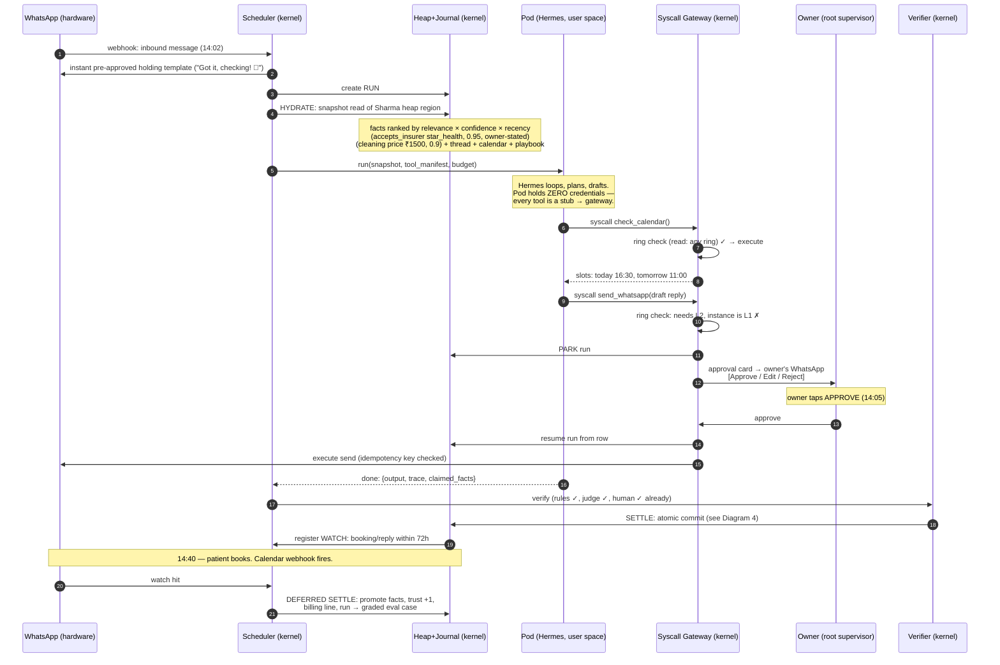
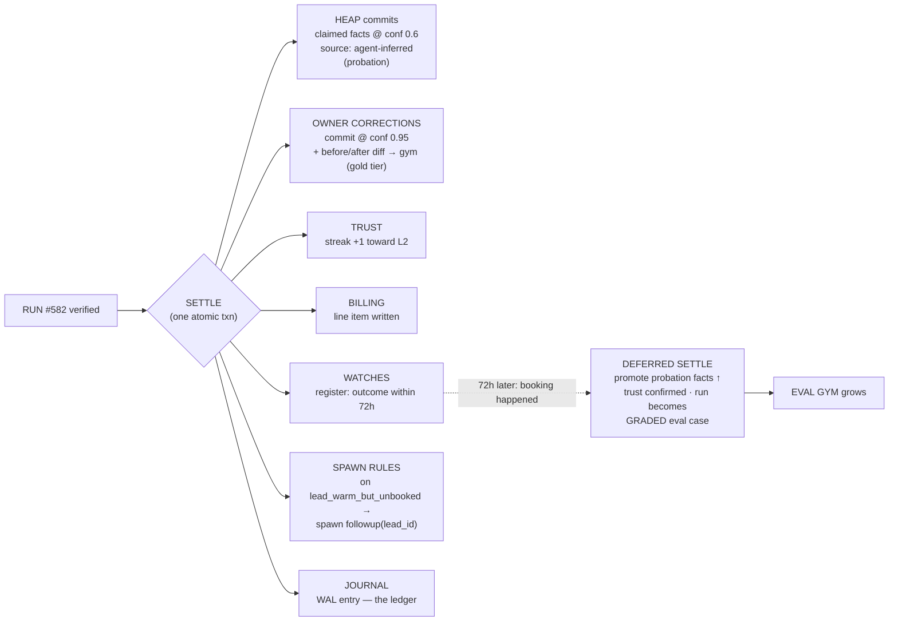
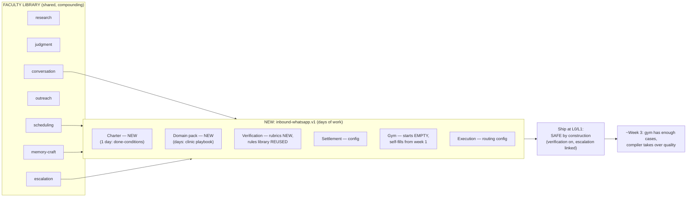
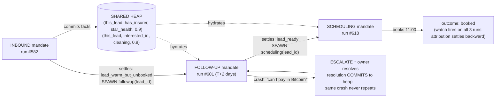
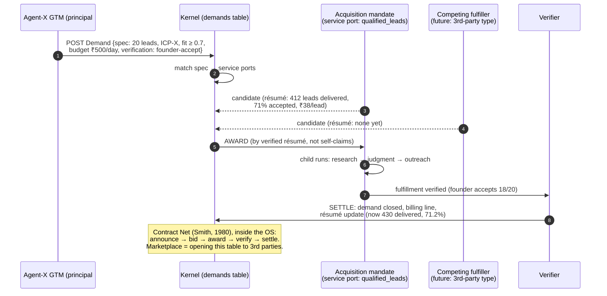
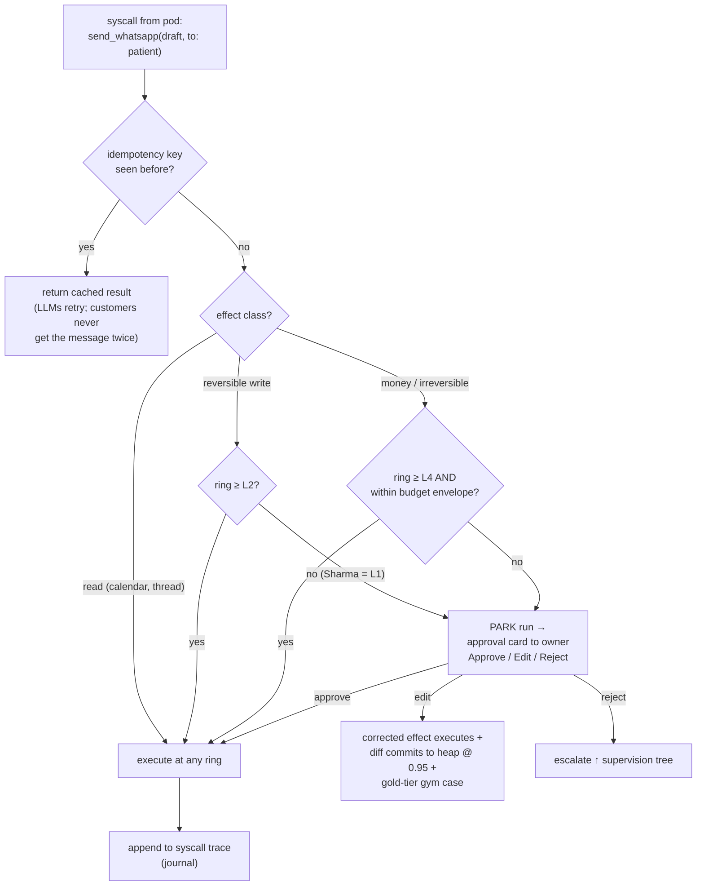
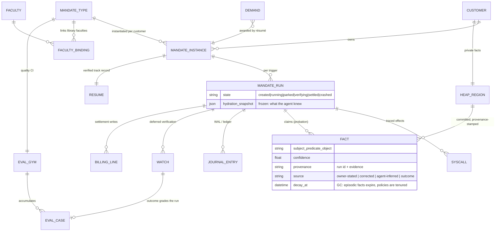

# Agent-X Architecture — Diagrams & Full Flows

*Companion to [README.md](./README.md). Every diagram is walked through with one of two running examples:*
- **Sharma Dental Clinic** — inbound WhatsApp mandate, instance at ring L1
- **Agent-X itself (principal #0)** — acquisition mandate selling the inbound product

Diagrams are Mermaid (render on GitHub / VS Code with Mermaid preview) plus ASCII where structure reads better as text.

---

## Diagram 1 — The three layers of a mandate

*Which field lives at which layer is the entire scaling story: top is shared by all customers, middle is private per customer, bottom is born and dies per trigger.*

```text
┌─────────────────────────────────────────────────────────────────────┐
│  MandateType  "inbound-whatsapp.v7"                  (CLASS)        │
│  shared by every customer · almost open-source · compiler-owned     │
│                                                                     │
│   charter schema · faculties · domain pack · verification suite     │
│   settlement rules · eval gym · execution profile                   │
└──────────────────────────────┬──────────────────────────────────────┘
                               │ instantiated per customer
        ┌──────────────────────┼──────────────────────┐
        ▼                      ▼                      ▼
┌───────────────┐      ┌───────────────┐      ┌───────────────┐
│ INSTANCE      │      │ INSTANCE      │      │ INSTANCE      │
│ Sharma Dental │      │ Restaurant B  │      │ Salon C       │
│ (OBJECT)      │      │               │      │               │
│ private state:│      │  ring: L2     │      │  ring: L0     │
│  ring: L1     │      │  heap region  │      │  heap region  │
│  heap region  │      │  résumé       │      │  résumé       │
│  résumé       │      │  overrides    │      │  overrides    │
│  overrides    │      └───────────────┘      └───────────────┘
└───────┬───────┘
        │ triggered per event (message, deadline, spawn, demand)
        ▼
┌─────────────────────────────────────────────┐
│ RUN #582  (STACK FRAME → durable            │
│            continuation, parks for days)    │
│  hydration snapshot (frozen)                │
│  syscall trace · claimed facts · scratchpad │
│  state: created→running→parked→…→settled    │
└─────────────────────────────────────────────┘
```

**Walk-through:** A patient messages Sharma Dental at 14:02. The Type (v7) supplies *how an inbound-WhatsApp mandate behaves*. The Instance supplies *what is true at Sharma's* (accepts Star Health, cleaning ₹1500, ring L1 → drafts need owner approval). Run #582 is created, lives ~40 minutes including a parked approval, settles, and is never mutated again — it remains forever as a journal entry and an eval case.

---

## Diagram 2 — Inside a MandateType: the seven organs



**Key reading:** the arrows form a loop — faculties act, verification judges, settlement records, the gym learns, the compiler rewrites the faculties. The quality of the mandate is the *speed of this loop*, not the cleverness of any single prompt. Each faculty is itself a bundle:

```text
Faculty "conversation" {
  skill_pack:    compiled prompts (compiler-owned artifact, versioned)
  tool_manifest: send_message, read_thread          (syscall stubs only)
  rubrics:       tone, factual grounding, one-question-per-message
  eval_slice:    its graded cases in the gym
  routing_hint:  strong model, latency-tolerant
}
```

---

## Diagram 3 — Full lifecycle of one run (the master flow)

*Sharma Dental, ring L1, patient asks: "Do you take Star Health insurance? How much is a cleaning?"*



**The three properties to notice:** (1) the hydration snapshot is frozen onto the run row — you can forever answer *"what did the agent know when it said that?"*; (2) the pod could be killed at any step and the run resumes from its row — no state lives in process memory; (3) the human approval is just another parked state, mechanically identical to waiting on a webhook.

---

## Diagram 4 — Settlement: the atomic commit fan-out

*Settlement is one transaction. Memory, trust, billing, evals, and spawns can never disagree about what happened.*



**The three births of customer memory**, all visible here: *claimed facts* enter on probation (the agent's beliefs, humbly); *owner corrections* enter as law (one thumb tap = one training event); *outcomes* promote or demote everything (reality is the only ungameable verifier). Six months of this is the heap region a departing customer loses.

---

## Diagram 5 — The excellence flywheel (how a mandate gets good)

```mermaid
flowchart TB
    RE["REALITY<br/>messages, bookings, replies, silence"] --> RUNS["Settled runs<br/>(verified, provenance-stamped)"]
    RUNS --> GYM["EVAL GYM (per Type)<br/>~900 graded cases / clinic / month<br/>gold tier: owner corrections"]
    GYM --> COMP["COMPILER (GEPA-style)<br/>reflects on failing traces,<br/>rewrites faculty skill packs<br/>(needs only 100–500 evals)"]
    COMP --> CAND["Candidate Type version v8"]
    CAND --> GATE{"REGRESSION GATE<br/>beats v7 on full gym?<br/>no rubric regressions?"}
    GATE -- fail --> COMP
    GATE -- pass --> CAN["CANARY<br/>consenting instances only"]
    CAN --> PROM["PROMOTE v8<br/>semver · changelog · rollback<br/>instance state survives (lives in heap)"]
    PROM --> RUNS

    style GYM fill:#1a3a1a,stroke:#4a4
    style COMP fill:#1a2a3a,stroke:#48f
```



**Why this kills the "Prompt Engineering Company" fear structurally:** a stolen prompt is a snapshot of `v7` — it decays the moment reality shifts, and the thief has no gym to compile `v8`. The founder's job moves up a level: curate rubrics, triage the compiler's losing cases, write the rule that catches a new failure class. One person's taste, compiled into every customer's agent.

---

## Diagram 6 — The Mandate SDK: assembling mandate #2 in days



**The honest promise:** mandate #2 does *not* start great — it starts **safe** (low ring, full verification, escalation wired in), and gets great automatically. `memory-craft` and `escalation` being library faculties is the deep win: writing good memory and failing well are engineered once, linked in everywhere.

---

## Diagram 7 — Workflow = deterministic spine, reasoning nodes

*The Sharma lead, across three mandates. Edges are declared in settlement rules (auditable in advance); node interiors are agentic (discovered at runtime).*



**Two semantics to hold onto:** there is no mandate-to-mandate message channel — *spawn is the function call, the heap is the return path*, and every inter-mandate "message" is a committed, verified fact with confidence attached. And failure is supervised, not handled: a confused mandate crashes upward with full context, and the human's resolution becomes permanent memory.

---

## Diagram 8 — The internal market (demand / résumé / award)

*Agent-X is principal #0: our own acquisition mandate fills our own funnel. Later, the same table is the marketplace.*



**Why this matters strategically:** "the acquisition agent sells everything we build" stops being a slogan and becomes a row in a table. And when two mandate types can fulfill the same demand, résumé + cost decide — capability arbitrage with verified outcomes as the price signal.

---

## Diagram 9 — The whole Business OS

```text
                            ┌────────────────────────────────────────────┐
                            │              CUSTOMERS' PROGRAMS           │
                            │   (each = a set of standing mandates)      │
 USER SPACE                 │                                            │
 (rented, disposable,       │  ┌─ Sharma Dental pod ─┐ ┌─ Restaurant B ─┐│
 zero credentials,          │  │ inbound · follow-up │ │ inbound · ...  ││
 zero durable state)        │  │ scheduling          │ │                ││
                            │  │ [Hermes today]      │ │ [OpenClaw]     ││
                            │  └──────────┬──────────┘ └───────┬────────┘│
                            └─────────────┼────────────────────┼─────────┘
                ═════════ ADAPTER LINE ═══╪════════════════════╪══════════
                            ┌─────────────▼────────────────────▼─────────┐
                            │                 KERNEL (the company)       │
                            │                                            │
                            │  SCHEDULER     reality + deadlines → runs  │
                            │  HEAP          per-customer regions,       │
                            │                transactional, journaled    │
                            │  LEDGER        the heap's WAL = audit trail│
                            │  VERIFIER      rules→judge→human→reality   │
                            │  SYSCALLS      ring-checked, idempotent    │
                            │  RINGS L0–L4   earned authority            │
                            │  SUPERVISION   forest: 1 tree per customer,│
                            │                owner at root               │
                            │  DEMANDS       internal market             │
                            │  COMPILER+GYMS per-Type quality CI         │
                            └───────┬───────────────────────┬────────────┘
                                    │                       │
                     ┌──────────────▼─────────┐   ┌─────────▼──────────────┐
                     │  HARDWARE (reality)    │   │ CATEGORY INTELLIGENCE  │
                     │  WhatsApp · CRM ·      │   │ settled journals →     │
                     │  calendar · email ·    │   │ patterns only, never   │
                     │  money                 │   │ facts → domain packs → │
                     │                        │   │ customer #50 starts at │
                     │  ← REVENUE flows here  │   │ day-1000 knowledge     │
                     └────────────────────────┘   │  ← MOAT compounds here │
                                                  └────────────────────────┘
```

**The asymmetry is the company:** everything above the adapter line is fungible compute you rent; everything below it is durable state you own. Two flows leave the kernel — one is revenue (real effects in the world), the other is the moat (verified experience compiling into priors). Swapping Hermes for whatever is cheapest-per-verified-outcome next quarter touches nothing below the line.

---

## Diagram 10 — Syscall enforcement: rings at the gateway



**Ring promotion is mechanical, not vibes:** N consecutive approvals with zero edits on an effect class → propose promotion to the owner; any reality-verified failure → automatic demotion review. "Your agent runs at L2 here, earned over 14 months, clean audit trail" is a sentence with mechanical meaning — and it is non-portable, which is the second leg of the moat.

---

## Diagram 11 — Data model (the dozen tables that are the whole company)



**Implementation honesty:** this is Postgres and a worker loop. The kernel-minimum for Phase 1 is roughly a dozen tables and one state machine — the sophistication is in the *invariants* (no fact without a commit; no credential in user space; no durable state below the adapter line; no cross-customer fact flow; no unverified résumé), not in the infrastructure.

---

## The flows, indexed

| # | Flow | Diagram |
|---|---|---|
| 1 | Class → object → stack frame | 1 |
| 2 | Inside a Type: the seven organs + quality loop | 2 |
| 3 | One run, trigger to deferred settlement | 3 |
| 4 | The atomic commit fan-out / births of memory | 4 |
| 5 | Gym → compiler → gate → canary → promote | 5 |
| 6 | Assembling a new mandate from the faculty library | 6 |
| 7 | Workflow: spawn edges, heap as return path, crash-upward | 7 |
| 8 | Internal market: demand → résumé award → settle | 8 |
| 9 | Whole OS: kernel / user space / hardware / intelligence | 9 |
| 10 | Ring enforcement + promotion mechanics | 10 |
| 11 | The data model | 11 |
