# FlowWalk: Mandate and Dashboard Readiness

## Question Answered

How close is Agent-X-OS to the canonical `BLUEPRINT.md`, how can an operator use the current lead-finder
mandate, and can the current dashboard operate the full flow?

This walkthrough covers the Phase-1 lead-finder, kernel resume/scheduler path, FastAPI control surface, and
Next.js dashboard. It does not treat intentionally deferred Phase 2–5 channels as Phase-1 blockers.

## Short Verdict

- **Phase-1 engine:** roughly **75–80% complete**. The mandate can run live, research, draft, park, resume,
  verify, and settle. The largest missing Phase-1 loop is reality maturation: watch/outcome → promoted facts,
  trust update, and a real gym case. The ~100-settle proof has not been run.
- **Dashboard read side:** roughly **70% complete**. It can display instances, runs, facts, journal events,
  capabilities, approval data through the API, and catalog rows.
- **Dashboard command side:** roughly **25–35% complete**. `set-ring` works. `approve` only journals the
  approval; it does not enqueue `ApprovalWork` or resume the run. Instantiate, trigger-run, run-swarm, and
  promote still return `501`.
- **End-to-end dashboard operability:** **not ready**. Today the reliable live path is the Python runner, not
  the web UI.
- **Whole Blueprint (Phases 1–5):** roughly **20–30%**, because Creator, Operator Agent, compiler, approved
  email/calendar/CRM, browser fallback, voice, WhatsApp, and money channels are intentionally later work.

These percentages are engineering judgment, not measurements defined by the Blueprint.

## Beginner Overview

A **MandateType** is the reusable job definition: goal, faculties, authority, verification, and settlement
rules. A **MandateInstance** binds that type to one business. A **run** is disposable: the kernel hydrates it
from durable memory, lets the harness propose actions, gates effects, and settles verified facts back.

The current lead-finder can execute this lifecycle:

```mermaid
flowchart LR
    A[MandateType] --> B[MandateInstance]
    B --> C[TriggerWork]
    C --> D[Hermes / MiniMax run]
    D --> E[Research + read URLs]
    E --> F[Claim facts]
    F --> G[draft_email proposal]
    G --> H[RunParked]
    H --> I[ApprovalResolved]
    I --> J[ApprovalWork]
    J --> K[Kernel resume]
    K --> L[Verify + RunSettled]
    L --> M[Heap facts + watch + resume projection]
```



That flow is code-proven and live-proven. The web dashboard does not yet connect all of those arrows.

## Start Here

Start at [run_lead_finder.py](/Volumes/Mrigesh%20SSD/Startup/Agent-X-OS/scripts/run_lead_finder.py:80).
It is the only current edge that composes Mongo, the live gateway, Hermes, continuation storage, scheduler
work, catalog registration, instance creation, approval, resume, and settlement in one place.

## Reading Path

1. [run_lead_finder.py](/Volumes/Mrigesh%20SSD/Startup/Agent-X-OS/scripts/run_lead_finder.py:80) — current
   runnable live composition.
2. [run_loop.py](/Volumes/Mrigesh%20SSD/Startup/Agent-X-OS/packages/kernel/src/agentx_kernel/run_loop.py:86) —
   invoke and resume lifecycle.
3. [scheduler.py](/Volumes/Mrigesh%20SSD/Startup/Agent-X-OS/packages/kernel/src/agentx_kernel/scheduler.py:19) —
   trigger and approval work.
4. [control.py](/Volumes/Mrigesh%20SSD/Startup/Agent-X-OS/packages/kernel/src/agentx_kernel/control.py:58) —
   catalog, approval inbox, approve, and ring commands.
5. [app.py](/Volumes/Mrigesh%20SSD/Startup/Agent-X-OS/api/src/agentx_api/app.py:108) — dashboard HTTP routes and
   unsupported commands.
6. [api.ts](/Volumes/Mrigesh%20SSD/Startup/Agent-X-OS/dashboard/src/lib/api.ts:88) — data the UI actually loads.
7. [operator-dashboard.tsx](/Volumes/Mrigesh%20SSD/Startup/Agent-X-OS/dashboard/src/components/operator-dashboard.tsx:138) —
   current Approve behavior.

## What Is Built

| Blueprint capability | Current status | Evidence |
| --- | --- | --- |
| Lead-finder mandate | Live-proven | Session F/G proof |
| LLM drives run loop | Live-proven | `HarnessRunner.step()` in `run_loop.py` |
| Gateway, rings, receipts | Live-proven | one effect and zero-row replay |
| Parked-run resume | Live-proven | `Phase1RunInvoker.resume()` |
| Scheduler-min | Live-proven | `TriggerWork`, `ApprovalWork`, Mongo worker |
| Journal, heap, résumé, watches | Built | Mongo projections |
| Catalog persistence | Built | `MandateRegistry` through `KernelControl` |
| Promptfoo judge + promotion gate | Built for synthetic/human tests | swarm package |
| Real gym maturation | Missing | watch registers, but no deferred maturation loop |
| Local Swarm REPL | Missing | underlying judge/scenario pieces exist |
| Creator Mandate | Missing | later Blueprint feature |
| Operator Agent | Missing | later Blueprint feature |
| Phase 2–5 channels | Missing by design | email send/calendar/CRM/browser/voice/WhatsApp |

## How To Use The Mandate Today

### Prerequisites

Create `.env` from `.env.example` with:

- `MONGODB_URI`, `MONGODB_DB_NAME`
- `MINIMAX_API_KEY`, `FACULTY_MODEL_BASE_URL`, `FACULTY_MODEL_ID`
- at least one of `EXA_API_KEY` or `FIRECRAWL_API_KEY`

Then install the workspace:

```bash
cd "/Volumes/Mrigesh SSD/Startup/Agent-X-OS"
uv sync
```

### Current live runner

```bash
uv run python scripts/run_lead_finder.py
```

This creates a new dogfood instance, schedules a trigger, runs live research, parks at the draft, then
programmatically approves and resumes it. It creates a **draft only**; it does not send email.

For a custom ICP:

```bash
AGENTX_EVAL_ICP_JSON='{"icp":"independent dental clinics","location":"Pune, India","count":3}' \
uv run python scripts/_eval_d_inspect.py
```

Important limitation: both scripts are proof runners and automatically perform the approval step. They are
not yet the desired human-in-the-loop operator workflow.

## Dashboard Runtime Flow Today

```mermaid
flowchart TD
    UI[Next.js dashboard] -->|poll every 8s| API[FastAPI]
    API --> Journal[(Journal)]
    API --> Projections[(Mongo projections)]
    UI -->|Approve| A[/commands/approve]
    A --> B[KernelControl.approve]
    B --> C[ManagerAction + ApprovalResolved]
    C -. missing .-> D[ApprovalWork]
    D -. missing .-> E[Kernel resume + settle]
```

### What works

- API reads for system overview, instances, runs, run detail, journal, capabilities, eval cases, and
  `/approvals`.
- `set-ring` journals and updates the résumé projection.
- The frontend compiles, its API client tests pass, and its production build succeeds.
- API tests pass.

### What does not work

1. **The UI does not load `/approvals`.** It loads `/manual-queue` into `data.manualQueue`
   ([api.ts](/Volumes/Mrigesh%20SSD/Startup/Agent-X-OS/dashboard/src/lib/api.ts:91)). The actual approval API
   exists, but the Approval view consumes the wrong dataset.
2. **Approve does not resume.** `/commands/approve` calls only `KernelControl.approve`
   ([app.py](/Volumes/Mrigesh%20SSD/Startup/Agent-X-OS/api/src/agentx_api/app.py:152)). It does not enqueue
   `ApprovalWork` or run the worker.
3. **The run can look no longer parked without settling.** Run summaries treat any `ApprovalResolved` as no
   longer parked, even when resume never happened.
4. **Create Instance is disabled.** The form button is disabled, and `/commands/instantiate` returns `501`,
   although core catalog instantiation now exists.
5. **Trigger Run is `501`.** Scheduler-min exists in core, but the API does not own a live invoker/worker.
6. **Foundry is read-only.** Run-swarm and promote are `501`; Creator is absent.
7. **Manual queue is process-local.** It is not a durable shared queue.
8. **Fixture fallback can mask outages.** Failed API requests silently substitute polished fake data. A source
   badge exists, but command-capable production mode should fail closed.
9. **No operator authentication.** CORS allows all origins and manager commands have no auth; do not expose the
   API publicly.

## What “Dashboard Ready” Should Mean

For Phase 1, the minimum honest definition is:

1. Create a lead-finder instance from the Catalog.
2. Trigger a live or sim run.
3. See the real parked approval card.
4. Approve or reject it.
5. Approval enqueues resume work and the UI observes the run settle.
6. Inspect facts, provenance, watch, receipt, and journal timeline.
7. Manual tasks survive API restarts.
8. The UI cannot display fixtures while claiming to be live.
9. Manager commands require local/operator authentication.

The current dashboard meets mainly the read portions of items 3 and 6.

## Guided IDE Reading Sequence

1. Open [run_lead_finder.py](/Volumes/Mrigesh%20SSD/Startup/Agent-X-OS/scripts/run_lead_finder.py:113).
   Focus on how the complete live runtime is composed.
2. Open [scheduler.py](/Volumes/Mrigesh%20SSD/Startup/Agent-X-OS/packages/kernel/src/agentx_kernel/scheduler.py:121).
   Focus on `SchedulerWorker.run_once`.
3. Open [app.py](/Volumes/Mrigesh%20SSD/Startup/Agent-X-OS/api/src/agentx_api/app.py:152).
   Notice that Approve stops after journaling.
4. Open [api.ts](/Volumes/Mrigesh%20SSD/Startup/Agent-X-OS/dashboard/src/lib/api.ts:88).
   Notice `/manual-queue` is loaded but `/approvals` is not.
5. Open [catalog-create.tsx](/Volumes/Mrigesh%20SSD/Startup/Agent-X-OS/dashboard/src/components/catalog-create.tsx:47).
   Notice the disabled Submit button.

## Tests And Verification

Verified on 2026-06-18:

```text
API: 7 passed
Dashboard client: 3 passed
Dashboard production build: passed (Next.js 15.5.19)
```

Local endpoint inspection also confirmed `/approvals` and `/manual-queue` return different datasets.
Browser UI automation was unavailable in this environment, so visual interaction was not re-tested.

## Risks, Assumptions, Unknowns

- The proof scripts auto-approve; they should not become the production interaction model.
- Draft truthfulness still needs a deterministic guardrail for unsupported performance/capability claims.
- Reality maturation and real eval cases remain the main Phase-1 learning-loop gap.
- Running ~100 settles requires operating discipline, cost tracking, and outcome capture, not only more code.

## Glossary

- **MandateType:** Reusable job specification.
- **MandateInstance:** One business-specific installation of a MandateType.
- **Hydration:** Loading the instance’s durable context into a fresh run.
- **Park:** Durable pause awaiting approval, webhook, or watch.
- **Continuation:** Saved run/harness state used to resume without regenerating prior reasoning.
- **Settlement:** Atomic commit of verified facts, trust effects, billing, watches, and spawns.
- **Projection:** Read-optimized state derived from the append-only journal.
- **Gym case:** A graded run used to evaluate or improve later mandate versions.
